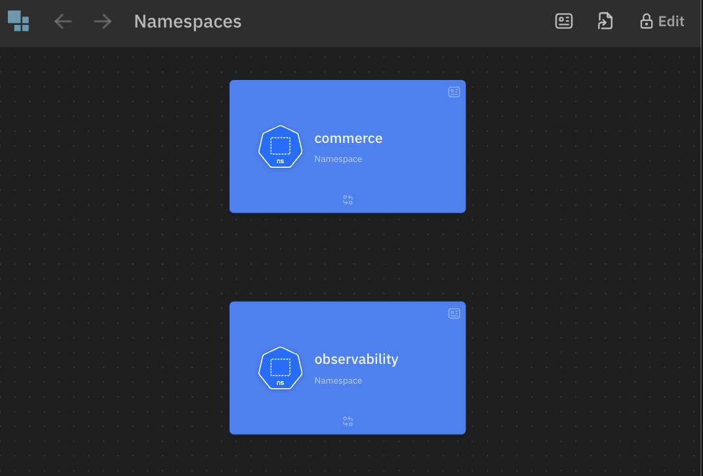
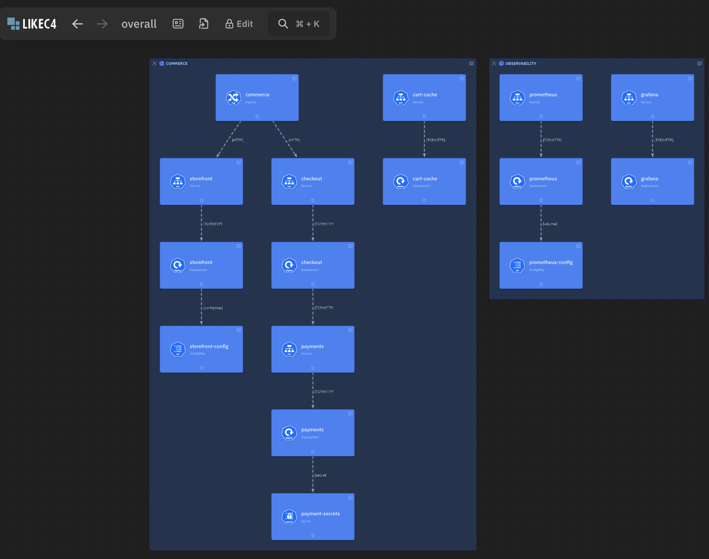

# k8sToC4

`k8sToC4` is a Java CLI that converts Kubernetes resources into C4-style `.c4` files. 
It can parse local YAML manifests or discover resources from the current Kubernetes context, 
then generate files that can be used as a starting point for LikeC4 visualization workflows.

## What It Generates

When an output directory is provided, the CLI writes:

- `spec.c4`: element specifications and styles
- `model.c4`: namespaces, Kubernetes resources, metadata and relationships
- `view.c4`: generated views for namespaces, nodes and label groups

Without `-o` / `--output`, the generated content is printed to stdout.

## Screenshot Placeholders

Add the real screenshots after rendering the generated `.c4` files.


### Namespace Overview



### Overall View



## Supported Mappings

The model builder detects common Kubernetes relationships, including:

- `Service -> Deployment/StatefulSet/Pod owner` through selectors
- `Ingress -> Service` through HTTP backend routes
- workload `-> ConfigMap` through `envFrom`, `env` and volume references
- workload `-> Secret` through environment and volume references
- workload `-> PersistentVolumeClaim` through volume references
- `PersistentVolume -> PersistentVolumeClaim` through claim binding

Supported resource families include:

- `Namespace`
- `Deployment`
- `StatefulSet`
- `DaemonSet`
- `Service`
- `Ingress`
- `ConfigMap`
- `Secret`
- `PersistentVolume`
- `PersistentVolumeClaim`
- cluster and generic fallback resources

## Requirements

- Java 21+
- Maven 3.x
- Optional: access to a Kubernetes cluster for `discover`

## Build

```bash
mvn -B package
```

The build creates:

```bash
target/k8stoc4-cli-1.0.jar
target/k8sToC4
```

## Usage

Parse a local manifest:

```bash
target/k8sToC4 parse \
  -i examples/manifests/hello-platform.yaml \
  -o output/hello-platform
```

Parse and group components by a Kubernetes label:

```bash
target/k8sToC4 parse \
  -i examples/manifests/ecommerce-observability.yaml \
  -o output/ecommerce \
  -g app.kubernetes.io/part-of
```

Force a namespace for manifests that omit one:

```bash
target/k8sToC4 parse \
  -i examples/manifests/hello-platform.yaml \
  -o output/hello-platform-dev \
  -n dev
```

Create placeholder entities for referenced resources that are missing from the input:

```bash
target/k8sToC4 parse \
  -i examples/manifests/hello-platform.yaml \
  -o output/hello-platform-complete \
  --rewrite-missing
```

Exclude noisy resource kinds from generated views:

```bash
target/k8sToC4 parse \
  -i examples/manifests/ecommerce-observability.yaml \
  -o output/ecommerce-filtered \
  -e configmap -e secret
```

Run from the shaded JAR instead of the executable wrapper:

```bash
java -jar target/k8stoc4-cli-1.0.jar parse \
  -i examples/manifests/wordpress-stack.yaml \
  -o output/wordpress
```

Discover resources from the active Kubernetes context:

```bash
target/k8sToC4 discover -o output/live-cluster
```

Discover continuously:

```bash
target/k8sToC4 discover -o output/live-cluster -w -r 30
```

## Examples

Example manifests live in [examples](examples/README.md):

- [hello-platform.yaml](examples/manifests/hello-platform.yaml): small app with frontend, API, database, ConfigMap, Secret and Ingress
- [ecommerce-observability.yaml](examples/manifests/ecommerce-observability.yaml): multi-namespace platform with label grouping and observability components
- [wordpress-stack.yaml](examples/manifests/wordpress-stack.yaml): WordPress and MySQL with services, secrets and PVCs

After building the CLI, try:

```bash
target/k8sToC4 parse -i examples/manifests/ecommerce-observability.yaml -o output/ecommerce -g app.kubernetes.io/part-of
```

Then load the generated `spec.c4`, `model.c4` and `view.c4` in your C4 visualization workflow.

## Code Structure

- `src/main/java/com/k8stoc4/cli`: CLI entrypoint and subcommands
- `src/main/java/com/k8stoc4/controller`: orchestration and input/output handling
- `src/main/java/com/k8stoc4/visitor`: Kubernetes resource traversal and model-building logic
- `src/main/java/com/k8stoc4/model`: internal C4 domain model
- `src/main/java/com/k8stoc4/presenter`: conversion from model objects to C4 DSL snippets
- `src/main/java/com/k8stoc4/render`: final `.c4` rendering
- `src/test`: focused unit and integration-style tests

## Development

Run the test suite:

```bash
mvn test
```

Build the distributable artifacts:

```bash
mvn -B package
```

## Contributing

See [CONTRIBUTING.md](CONTRIBUTING.md).

## License

Apache License 2.0. See [LICENSE](LICENSE).
